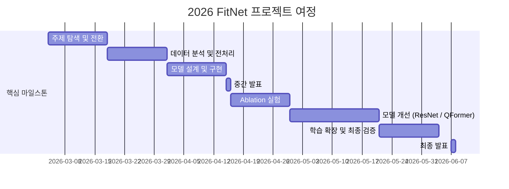

# FitNet
인공지능응용 팀 프로젝트 : Py-thing팀(파이팅)

<div align="center">
<a href="https://aihub.or.kr/aihubdata/data/view.do?dataSetSn=71501"></a>
</div>
<br>


## 🌟 프로젝트 개요 (Project Overview)

온라인 패션 시장의 반품률은 약 40%에 달하며 주요 원인은 사이즈 불일치입니다. 기존 AI 기반 가상 피팅(Virtual Try-On) 서비스는 체형을 고려하지 않아 옷이 항상 잘 맞는 것처럼 합성하는 근본적인 한계가 있습니다.

**FitNet**은 2D 착장 이미지와 신체 치수를 함께 활용해 현재 착용 중인 의류의 실제 치수(cm)를 예측하는 모델입니다. 이를 통해 체형에 따라 옷이 어떻게 맞는지를 수치적으로 파악하고, 궁극적으로 체형을 고려한 치수 인식 가상 피팅 AI로의 확장을 목표로 합니다.

```
입력: 착장 이미지 + 신체 치수  →  출력: 의류 치수 (어깨·총장·가슴·허리·소매, cm 단위)
```
<br>


## 🎯 프로젝트 목표 (Project Vision)

### 핵심 목표
- 👗 **의류 치수 예측 모델 학습**
  - 2D 착장 이미지 + 신체 치수 → 의류 치수(cm) 예측
  - 어깨너비 / 총장 / 가슴둘레 / 허리둘레 / 소매길이 5개 항목
- 🔬 **이미지 기여도 검증 (Ablation)**
  - 신체-only MLP 베이스라인 대비 이미지 사용 모델 성능 비교
  - FiLM / Cross-Attention / Q-Former 3가지 조건화 변형 실험
- 🔗 **가상 피팅 연결 시도**
  - FitNet 예측 결과를 SiCo 파이프라인에 연결
  - Z-score 기반 부위별 마스크 조정으로 치수 정보 반영

### 💻 적용 기술
- 🧠 **모델 아키텍처**
  ```
  U-Net Encoder-Decoder | ResNet-50 Backbone | FiLM Conditioning
  Q-Former Regression Head | Multi-task Learning (Seg + Regression)
  ```
- 📦 **데이터 파이프라인**
  ```
  AI Hub 의류 통합 데이터 (No. 71501) | Letterbox Resize | Polygon 래스터화
  Z-score 정규화 | 카테고리 임베딩 (13차원 입력)
  ```
- 🔧 **학습 환경**
  ```
  PyTorch | OpenCV | MediaPipe | WandB | Google Colab
  ```


## 🧑 팀 소개
| 이름 | 이메일 | 소속 | 역할 | 담당 부분 |
|--------|---------|-------|-------|----------|
| 이현경 | blue87083@gmail.com | 컴퓨터공학과 | 팀장 | 모델 성능향상 방향 제시, SiCo 기반 가상 피팅 확장 계획, FIT 논문 분석 |
| 이가윤 | gayunphone@gmail.com | 컴퓨터공학과 | 팀원 | 모델 성능향상 방향 제시, SiCo 기반 가상 피팅 확장 계획, 발표 자료 준비 |
| 양진선 | yanggi200@gmail.com | 컴퓨터공학과 | 팀원 | 모델 구조 변경(세그먼트 헤드 개선, 카테고리 분리), Ablation 실험 진행 |
| 손정민 | suruna1026@gmail.com | 컴퓨터공학과 | 팀원 | 모델 구조 변경(Regression Head 개선, Pretrained 백본 도입), Ablation 실험 진행 |
| 이윤설 | leeyunseol.cs@gmail.com | 컴퓨터공학과 | 팀원 | 모델 성능 분석 |


## 🚀 프로젝트 로드맵 (Project Roadmap)



## 📅 주차별 활동 (Activity History)

| 주차 | 단계 | 주요 활동 |
|------|------|-----------|
| 5주차 | 주제 탐색 | LLaVA·LoRA 기반 초기 아이디어 테스트 → 학습 어려움 확인. 프로젝트 목표 재정의 |
| 6주차 | 주제 변경 | 가상 피팅 AI의 한계 확인 후 의류 치수 예측으로 주제 전환. 기존 연구 분석 |
| 7주차 | 데이터 전처리 | JSON 직접 파싱 — 파일명/type 불일치, 이상치, 키 중첩 구조 발견. dataset.py 구현. 23,775개 중 12,449개 정제 |
| 8주차 | 전처리 검증·모델 설계 | letterbox resize 시각화로 비율 왜곡 없음 확인. U-Net + FiLM 구조 설계. **중간 발표** |
| 9주차 | 모델 구현 | 디코더 출력을 seg_head / d1 feature로 분기. Loss: BCE + MSE (λ=1.0:0.1) 확정 |
| 10주차 | Ablation 실험 | MLP 베이스라인(신체만), FiLM 제거, 기존 CNN 비교. 이미지 기여도 검증 |
| 11주차 | 모델 개선 1 | Pretrained ResNet-50 백본 도입. MediaPipe 스케일 정규화 검토 (적용 후 성능 하락 확인 → 미적용 결정) |
| 12주차 | 모델 개선 2 | Attention Pooling + Multi-scale Regression Head. Q-Former 헤드 설계 |
| 13주차 | 학습 확장 | Blouse + Shirt 통합 학습. 카테고리 one-hot 분리. **Best MAE 3.40208cm 달성** |
| 14주차 | 마무리 | 최종 모델 확정(Exp 6 Q-Former). FiLM 효과 재평가. SiCo 연결 구현. 최종 보고서 작성 |


## 📊 최종 성능 (Final Results)

> 최종 모델: `exp6_qformer_no_norm_blouse_shirt` (33 epochs)

| 지표 | 값 |
|------|-----|
| **MAE (전체 평균)** | **3.40208 cm** |
| RMSE | 4.87984 cm |
| Val Loss (Best) | 0.048886 |

**항목별 MAE**

| 어깨너비 | 총장 | 소매길이 | 가슴둘레 | 허리둘레 |
|---------|------|---------|---------|---------|
| 2.26 cm | 2.74 cm | 2.84 cm | 4.48 cm | 4.70 cm |

**카테고리별 MAE**

| 블라우스 | 셔츠 |
|---------|------|
| 3.80 cm | 3.10 cm |

초기 모델(블라우스 단독, 경량 CNN) 대비 **MAE 3.72cm → 3.40cm, 약 9% 개선**


## 🛠️ 우리의 개발 문화 (Our Development Culture)

```python
class FitNetDevelopment:
    def __init__(self):
        self.tools = {
            'communication': 'KakaoTalk',
            'experiment_tracking': 'WandB',
            'version_control': 'GitHub',
            'compute': 'Google Colab (T4 GPU)',
            'data': 'Google Drive',
        }
```


## 🔍 주요 발견 (Key Findings)

| 발견 | 내용 |
|------|------|
| 📌 **이미지 기여 확인** | 신체-only MLP(Exp1) 대비 이미지 사용 모델의 MAE가 더 낮아 이미지의 실질적 기여 검증 |
| ⚠️ **FiLM 효과 제한** | FiLM 제거 모델(Exp2/3)이 FiLM 적용(Exp4)과 유사하거나 더 낮은 오차 기록 → 한 옷-한 모델 매칭 데이터 구조로 인해 체형 대조 신호 부족으로 분석 |
| ❌ **MediaPipe 역효과** | 착용 이미지에서 관절 랜드마크 정확도 저하 → val loss 0.6345→0.8195 악화, 최종 미적용 |
| ✅ **통합 학습 효과** | 블라우스+셔츠 통합 학습 + 카테고리 임베딩 분리가 블라우스 단독 대비 성능 향상 |


## 📈 성과 지표 (Achievement Metrics)

| 지표 | 목표 | 달성 결과 |
|------|------|-----------|
| 의류 치수 예측 모델 학습 | MAE 5cm 이하 | ✅ MAE 3.40cm |
| 이미지 기여도 Ablation 검증 | 이미지 사용 시 성능 향상 확인 | ✅ 달성 |
| 분할+회귀 동시 학습 파이프라인 | U-Net 기반 멀티태스크 구현 | ✅ 달성 |
| 다중 카테고리 확장 | 2개 이상 카테고리 지원 | ✅ Blouse / Shirt / Coat 지원 |
| 가상 피팅 연결 시도 | FitNet → VTO 파이프라인 연결 | ✅ SiCo Z-score 마스크 조정 구현 |


## 📁 프로젝트 구조 (Project Structure)

```
FitNet/
├── dataset.py          # 데이터 로딩 / 전처리 / 정규화 파이프라인
├── model.py            # U-Net + ResNet-50 + FiLM + Q-Former 모델 정의
├── train.py            # 학습 루프 / Ablation 실험 / 평가 / 신체 피처 중요도 분석
├── stats_analysis.py   # 카테고리별 정규화 통계 산출
└── checkpoints/        # 학습된 모델 체크포인트 저장
```


## ⚙️ 실행 방법 (Getting Started)

```bash
# 환경 설치
pip install torch torchvision opencv-python numpy pillow
pip install wandb  # 선택

# 정규화 통계 산출
python stats_analysis.py \
    --json_dirs /path/to/label_blouse /path/to/label_shirt \
    --categories blouse shirt --view_type wear

# 최종 모델 학습 (Exp6 Q-Former, Blouse+Shirt)
python train.py --exp 6 \
    --json_dirs /path/to/label_blouse /path/to/label_shirt \
    --image_dirs /path/to/image_blouse /path/to/image_shirt \
    --categories blouse shirt --epochs 33 --batch_size 16

# Ablation 전체 실행 (Exp1~4)
python train.py --all \
    --json_dir /path/to/label_blouse \
    --image_dir /path/to/image_blouse --categories blouse

# 평가만 수행
python train.py --exp 6 --eval_only \
    --categories blouse shirt \
    --json_dirs /path/to/label_blouse /path/to/label_shirt \
    --image_dirs /path/to/image_blouse /path/to/image_shirt
```


## 🔭 향후 연구 방향 (Future Work)

1. **합성 데이터 보완** — GarmentCode 기반으로 체형 다양성 확보 → FiLM 효과 재검증
2. **FIT 논문과 결합 검토** — 텍스트 기반 치수 주입 vs 숫자 벡터 FiLM 비교 및 결합


## 📚 참고 문헌 (References)

- Ronneberger et al., **U-Net: Convolutional Networks for Biomedical Image Segmentation**, MICCAI 2015
- Perez et al., **FiLM: Visual Reasoning with a General Conditioning Layer**, AAAI 2018
- Li et al., **BLIP-2: Bootstrapping Language-Image Pre-training with Frozen Image Encoders and Large Language Models**, ICML 2023
- Kim et al., **FIT: Fit-Aware Virtual Try-On**, arXiv:2604.08526, 2025
- **AI Hub 의류 통합 데이터**, Dataset No. 71501
