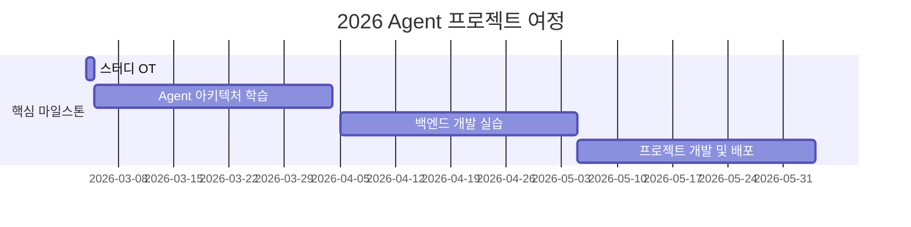

# AI-Application
인공지능 응용 팀 프로젝트 : Py-thing팀(1팀)

<div align="center">
<a href="https://pseudo-lab.com"></a>
<a href="https://discord.gg/EPurkHVtp2"></a>
<a href="https://github.com/Pseudo-Lab/10th-template/stargazers"></a>
<a href="https://github.com/Pseudo-Lab/10th-template/network/members"></a>
<a href="https://github.com/Pseudo-Lab/10th-template/pulls"></a>
<a href="https://github.com/Pseudo-Lab/10th-template/issues"></a>
</div>
<br>


## 🌟 프로젝트 개요 (Project Overview)
2025년은 'AI 에이전트'의 해로 주목받고 있습니다. 가트너의 예측에 따르면 2028년까지 일상 업무의 15%를 AI 에이전트가 독자적으로 결정할 것으로 전망되며, 이미 주요 기업들의 치열한 개발 경쟁이 시작되었습니다. 내 커리어, 내 주변, 사회적인 선한 영향력을 주제로 하는 실전에서 쓸 수 있는 Agent 를 개발하며 AI 뿐만아니라 CS 지식을 같이 개발하면서 대체불가 인력으로 성장을 목표로 합니다.
<br>  
<br>  


## 🎯 프로젝트 목표 (Project Vision)

### 이론 학습
- 🛠️ **최신 프레임워크 마스터링**
  - LangChain, LangGraph
  - LlamaIndex
  - AutoGen
  - Crew AI
  - hard coding 
- 🎯 **핵심 기술 역량**
  - Prompt Engineering
  - Agent 설계 패턴
  - 윤리적 고려사항
  - Multi-Agent 시스템

### 💻 실전 개발
- 🌐 **백엔드 아키텍처**
  ```
  FastAPI | Flask | Spring
  ```
- 🚀 **인프라 구축**
  ```
  Docker | Kubernetes | CI/CD
  ```
- 📊 **모니터링 시스템**
  ```
  로깅 | 메트릭스 | 알림
  ```


## 🧑 팀 소개
| 이름 | 이메일 | 소속 | 역할 | 담당 부분 |
|--------|---------|-------|-------|----------|
| [이현경] | blue87083@gmail.com | 컴퓨터공학과 | 팀장 | - 백엔드 개발<br>- 실제로 쓸 수 있는 에이전트 |
| [손정민] | suruna1026@gmail.com | 컴퓨터공학과 | 팀원 | - 폭발적 효율성의 Agent<br>- Graph Neural Network |
| [양진선] | yanggi200@gmail.com | 컴퓨터공학과 | 팀원 | - 폭발적 효율성의 Agent<br>- Graph Neural Network |
| [이가윤] | gayunphone@gmail.com | 컴퓨터공학과 | 팀원 | - 폭발적 효율성의 Agent<br>- Graph Neural Network |
| [이윤설] | leeyunseol.cs@gmail.com | 컴퓨터공학과 | 팀원 | - 폭발적 효율성의 Agent<br>- Graph Neural Network |


## 🚀 프로젝트 로드맵 (Project Roadmap)


## 📅 주차별 활동 (Activity History)

## 일정 개요
| 주차   | 날짜         | 내용                                         | 
|--------|------------|--------------------------------------------|
| 5주차  | 2025/04/06 | Agent 관련 논문 발표 및 프로젝트 상황 공유  |
| 6주차  | 2025/04/13 | Agent 관련 논문 발표 및 프로젝트 상황 공유  |
| 7주차  | 2025/04/20 | Agent 관련 논문 발표 및 프로젝트 상황 공유  |
| 8주차  | 2025/04/27 | Magical Weeks 🧙  (with 빌더 루프탑 바베큐 🍖) | 
| 9주차  | 2025/05/04 | Agent 관련 논문 발표 및 프로젝트 상황 공유  | 
| 10주차 | 2025/05/11 | Agent 관련 논문 발표 및 프로젝트 상황 공유  | 
| 11주차 | 2025/05/18 | 프로젝트 최종 점검                          | 
| 12주차 | 2025/05/25 | 최종 프로젝트 발표                          | 

## 🛠️ 우리의 개발 문화 (Our Development Culture)
```python
class CollaborationFramework:
    def __init__(self):
        self.tools = {
            'communication': 'Discord',
            'version_control': 'GitHub Projects',
            'ci/cd': 'GitHub Actions',
            'docs': 'Github Wiki'
        }
    
    def workflow(self):
        return """주간 사이클:
        1️⃣ 주말 "모각코" 진행 (선택) 
        2️⃣ Self-Brading (나를 알립시다)
        3️⃣ Creative Spark⚡️ 모두에게 창의력을 !"""
```

## 📈 성과 지표 (Achievement Metrics)
**2026 주요 MVP**
| 지표 | 목표 | 현재 달성률 |
|------|---------|-------------|
| Agent 구현 프로젝트 | n 개 | 0% |
| 기술 블로그 포스팅 | 조정중| 0% |


