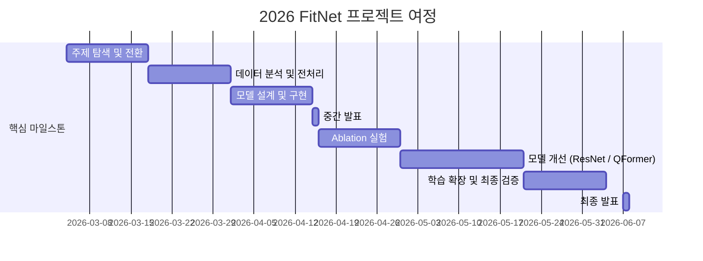

# FitNet
인공지능응용 팀 프로젝트 : Py-thing팀(파이팅)

<div align="center">
<a href="https://aihub.or.kr/aihubdata/data/view.do?dataSetSn=71501"></a>
</div>
<br>


## 🌟 프로젝트 개요 (Project Overview)

온라인 패션 시장의 반품률은 약 40%에 달하며 주요 원인은 사이즈 불일치입니다. 기존 AI 기반 가상 피팅(Virtual Try-On) 서비스는 체형을 고려하지 않아 옷이 항상 잘 맞는 것처럼 합성하는 근본적인 한계가 있습니다. 또한 SNS·세컨핸드 플랫폼 등에서는 치수 정보 자체가 누락된 경우가 빈번해, 실제 구매 결정에 어려움을 줍니다.

**FitNet**은 2D 착장 이미지와 신체 치수를 함께 활용해 현재 착용 중인 의류의 실제 치수(cm)를 예측하는 모델입니다. 이를 통해 체형에 따라 옷이 어떻게 맞는지를 수치적으로 파악하고, 궁극적으로 체형을 고려한 치수 인식 가상 피팅 AI로의 확장을 목표로 합니다.

```
입력: 착장 이미지 + 신체 치수  →  출력: 의류 치수 (어깨·총장·가슴·허리·소매, cm 단위)
```
<br>


## 🎯 프로젝트 목표 (Project Vision)

### 핵심 목표
- 👗 **의류 치수 예측 모델 학습**
  - 2D 착장 이미지 + 신체 치수 → 의류 치수(cm) 예측
  - 어깨너비 / 총장 / 가슴둘레 / 허리둘레 / 소매길이 5개 항목
- 🔬 **이미지 기여도 검증 (Ablation)**
  - 신체-only MLP 베이스라인 대비 이미지 사용 모델 성능 비교
  - MLP / Image-only Q-Former / FiLM+RegressionHead / FiLM+Q-Former / FiLM 제거+Q-Former 6가지 실험 조건
- 🔗 **가상 피팅 연결 시도**
  - FitNet 예측 결과를 SiCo 파이프라인에 연결
  - AI Hub 통계 기반 Relative Z-score 계산 후 DensePose 부위별 마스크 조정으로 치수 정보 반영

### 💻 적용 기술
- 🧠 **모델 아키텍처**
  ```
  U-Net Encoder-Decoder | ResNet-50 Pretrained Backbone | Q-Former Regression Head
  Multi-task Learning (Seg + Regression) | Weighted MSE Loss
  ```
- 📦 **데이터 파이프라인**
  ```
  AI Hub 의류 통합 데이터 (No. 71501) | Letterbox Resize | Polygon 래스터화
  Z-score 정규화 | Train/Val/Test 8:1:1 분할 (seed=42)
  ```
- 🔧 **학습 환경**
  ```
  PyTorch | OpenCV | MediaPipe | WandB | Google Colab (T4 GPU)
  ```


## 🧑 팀 소개
| 이름 | 이메일 | 소속 | 역할 | 담당 부분 |
|--------|---------|-------|-------|----------|
| 이현경 | blue87083@gmail.com | 컴퓨터공학과 | 팀장 | 모델 성능향상 방향 제시, SiCo 기반 가상 피팅 확장 계획, FIT 논문 분석 |
| 이가윤 | gayunphone@gmail.com | 컴퓨터공학과 | 팀원 | 모델 성능향상 방향 제시, SiCo 기반 가상 피팅 확장 계획, 발표 자료 준비 |
| 양진선 | yanggi200@gmail.com | 컴퓨터공학과 | 팀원 | 초기 모델 구현, 모델 구조 디벨롭, Ablation 실험 진행, 최종 실험 관리 |
| 손정민 | suruna1026@gmail.com | 컴퓨터공학과 | 팀원 | 모델 구조 디벨롭(Regression Head 개선, Pretrained 백본 도입), Ablation 실험 진행 |
| 이윤설 | leeyunseol.cs@gmail.com | 컴퓨터공학과 | 팀원 | 모델 성능 분석 |


## 🚀 프로젝트 로드맵 (Project Roadmap)



## 📅 주차별 활동 (Activity History)

| 주차 | 단계 | 주요 활동 |
|------|------|-----------|
| 5주차 | 주제 탐색 | LLaVA·LoRA 기반 초기 아이디어 테스트 → 학습 어려움 확인. 프로젝트 목표 재정의 |
| 6주차 | 주제 변경 | 가상 피팅 AI의 한계 확인 후 의류 치수 예측으로 주제 전환. 기존 연구 분석 |
| 7주차 | 데이터 전처리 | JSON 직접 파싱 — 파일명/type 불일치, 이상치, 키 중첩 구조 발견. dataset.py 구현. 23,775개 중 12,449개 정제 |
| 8주차 | 전처리 검증·모델 설계 | letterbox resize 시각화로 비율 왜곡 없음 확인. U-Net + FiLM 구조 설계. **중간 발표** |
| 9주차 | 모델 구현 | 디코더 출력을 seg_head / d1 feature로 분기. Loss: BCE + MSE (λ₁=1.0, λ₂=0.5) 확정 |
| 10주차 | Ablation 실험 | MLP 베이스라인(신체만), Image-only Q-Former, FiLM+RegressionHead 비교. 이미지 기여도 검증 |
| 11주차 | 모델 개선 1 | Pretrained ResNet-50 백본 도입. MediaPipe 스케일 정규화 검토 (적용 후 val loss 0.6345→0.8195 악화 → 미적용 결정) |
| 12주차 | 모델 개선 2 | Attention Pooling + Multi-scale Regression Head. Q-Former 헤드 설계 |
| 13주차 | 학습 확장 | Blouse + Shirt 통합 학습. 카테고리 one-hot 분리. FiLM vs Q-Former 비교 실험 |
| 14주차 | 마무리 | **최종 모델 Exp3(Image+Body, FiLM 제거, Q-Former) MAE 3.49cm 확정**. FiLM 효과 재평가. SiCo 연결 구현. 최종 보고서 작성 |


## 📊 최종 성능 (Final Results)

> 최종 모델: `Exp3 — Image+Body, FiLM 없음, Q-Former` (30 epochs)

| 지표 | 값 |
|------|-----|
| **MAE (전체 평균)** | **3.49 cm** |
| 상대 오차 (전체 평균) | 5.4% |

**항목별 MAE**

| 어깨너비 | 총장 | 소매길이 | 가슴둘레 | 허리둘레 |
|---------|------|---------|---------|---------|
| 2.50 cm | 2.75 cm | 2.99 cm | 4.53 cm | 4.67 cm |

**Ablation 실험 전체 결과**

| 실험 | 모델 | 전체 MAE | 어깨 | 총장 | 가슴 | 허리 | 소매 |
|------|------|---------|------|------|------|------|------|
| Exp1 | MLP (신체만) | 7.53 cm | 3.93 | 5.81 | 7.50 | 8.08 | 12.35 |
| Exp2 | Image-only Q-Former | 3.75 cm | 2.61 | 3.06 | 4.85 | 5.05 | 3.20 |
| **Exp3 (최종)** | **Image+Body, FiLM 없음, Q-Former** | **3.49 cm** | **2.50** | **2.75** | **4.53** | **4.67** | **2.99** |
| Exp4 | Image+Body+FiLM, RegressionHead | 3.67 cm | 2.67 | 2.86 | 4.93 | 4.95 | 2.94 |
| Exp6 | Image+Body+FiLM, Q-Former | 3.60 cm | 2.73 | 2.84 | 4.54 | 4.71 | 3.17 |

신체-only 베이스라인(Exp1, MAE 7.53cm) 대비 최종 모델(Exp3, MAE 3.49cm)은 **약 54% 오차 감소** 달성.


## 🔍 주요 발견 (Key Findings)

| 발견 | 내용 |
|------|------|
| 📌 **이미지 기여 확인** | 신체-only MLP(Exp1, 7.53cm) 대비 이미지 사용 모델(Exp3, 3.49cm)로 MAE 54% 감소. 이미지 feature의 실질적 기여 수치 검증 |
| ✅ **Q-Former 우수성** | Q-Former 회귀 헤드(Exp3, 3.49cm)가 Average Pooling + MLP RegressionHead(Exp4, 3.67cm)보다 낮은 오차. 치수별 전담 쿼리 토큰의 효과 |
| ⚠️ **FiLM 효과 소멸** | Q-Former 도입 후 FiLM을 추가한 Exp6(3.60cm)이 FiLM 없는 Exp3(3.49cm)보다 오히려 오차 큼 → Q-Former Cross-Attention이 body 정보 통합을 이미 충분히 수행해 FiLM이 중복이 됨 |
| ❌ **MediaPipe 역효과** | 착용 이미지에서 어깨 랜드마크 추정 정확도 저하 → val loss 0.6345→0.8195 악화. 최종 미적용, letterbox 고정 |
| 🔲 **둘레 예측의 구조적 한계** | 가슴·허리 둘레는 정면 사진에 앞 폭만 포착되어 3D→2D 정보 손실이 불가피. 어깨·총장·소매 등 경계 기반 항목(2~3cm 오차)에 비해 상대적으로 오차 큼 |


## 🛠️ 우리의 개발 문화 (Our Development Culture)

```python
class FitNetDevelopment:
    def __init__(self):
        self.tools = {
            'communication': 'KakaoTalk',
            'experiment_tracking': 'WandB',
            'version_control': 'GitHub',
            'compute': 'Google Colab (T4 GPU)',
            'data': 'Google Drive',
        }
```


## 📈 성과 지표 (Achievement Metrics)

| 지표 | 목표 | 달성 결과 |
|------|------|-----------|
| 의류 치수 예측 모델 학습 | MAE 5cm 이하 | ✅ MAE 3.49cm (Exp3) |
| 이미지 기여도 Ablation 검증 | 이미지 사용 시 성능 향상 확인 | ✅ Exp1 대비 54% 오차 감소 |
| 분할+회귀 동시 학습 파이프라인 | U-Net 기반 멀티태스크 구현 | ✅ Seg + 마스크 가중 Q-Former 회귀 동시 학습 |
| 다중 카테고리 확장 | 2개 이상 카테고리 지원 | ✅ Blouse / Shirt 지원 |
| 가상 피팅 연결 시도 | FitNet → VTO 파이프라인 연결 | ✅ SiCo Z-score 기반 부위별 마스크 조정 구현 |
| 전문 장비 없이 치수 추정 | 2D 이미지만으로 수 cm 오차 수준 | ✅ 일반 RGB 이미지 + 공개 데이터만으로 달성 |


## 📁 프로젝트 구조 (Project Structure)

```
FitNet/
├── dataset.py          # 데이터 로딩 / 전처리 / 정규화 파이프라인
├── model.py            # U-Net + ResNet-50 + Q-Former 모델 정의 (FiLM 조건화 포함)
├── train.py            # 학습 루프 / Ablation 실험 (Exp1~6) / 평가 / 신체 피처 중요도 분석
├── infer.py            # 추론 스크립트 (테스트셋 샘플 추출 및 시각화)
├── stats_analysis.py   # 카테고리별 정규화 통계 산출
└── checkpoints/        # 학습된 모델 체크포인트 저장
```


## ⚙️ 실행 방법 (Getting Started)

```bash
# 환경 설치
pip install torch torchvision opencv-python numpy pillow
pip install mediapipe wandb  # 선택

# 데이터 준비
/content/label_blouse/*.json      # 라벨(JSON)
/content/image_blouse/*.jpg       # 착용 이미지

/content/label_shirt/*.json,  /content/image_shirt/*.jpg # 다중 카테고리


# 정규화 통계 산출
python stats_analysis.py \
    --json_dirs /path/to/label_blouse,/path/to/label_shirt \
    --categories blouse,shirt --view_type wear

# 최종 모델 학습 (Exp3: Image+Body, FiLM 없음, Q-Former)
python /data/jinseon/AiApplication/train.py \
  --exp 3 \
  --wandb_project clothing-ablation \
  --wandb_run exp3 \
  --json_dir /data/jinseon/AiApplication/dataset \
  --image_dir /data/jinseon/AiApplication/dataset/image_blouse \
              /data/jinseon/AiApplication/dataset/image_shirt \
  --view_type wear \
  --categories blouse shirt

# 평가 및 추론 : exp3, test split에서 5개 추출
python infer.py \
  --ckpt checkpoints/exp3_image_body_no_film_qformer/epoch_030.pth \
  --n 5 --out_dir ./infer_output_exp3 --seed 7

```


## 🔭 향후 연구 방향 (Future Work)

1. **합성 데이터 보완** — GarmentCode 기반으로 다양한 체형-의류 조합 합성 데이터 구축 → 체형 다양성 확보 및 FiLM 효과 재검증
2. **가슴·허리 둘레 예측 개선** — 세그멘테이션 마스크의 행별 폭 프로파일을 추가 feature로 활용, 또는 측면 이미지 보조 입력 검토
3. **학습 기반 Fit-Aware VTO 확장** — StableVITON 등 학습 가능한 VTO 모델에 치수 정보를 조건으로 주입하여 핏 변화 직접 학습
4. **FIT 방식과 결합 검토** — 텍스트 기반 치수 조건화(FIT) vs 수치 벡터 기반(FitNet) 비교 및 결합


## 📚 참고 문헌 (References)

- Ronneberger et al., **U-Net: Convolutional Networks for Biomedical Image Segmentation**, MICCAI 2015
- Perez et al., **FiLM: Visual Reasoning with a General Conditioning Layer**, AAAI 2018
- Li et al., **BLIP-2: Bootstrapping Language-Image Pre-training with Frozen Image Encoders and Large Language Models**, ICML 2023
- Karras et al., **FIT: A Large-Scale Dataset for Fit-Aware Virtual Try-On**, arXiv:2604.08526, 2026
- Chong et al., **CatVTON: Concatenation Is All You Need for Virtual Try-On with Diffusion Models**, ICLR 2025
- Kim et al., **StableVITON: Learning Semantic Correspondence with Latent Diffusion Model for Virtual Try-On**, CVPR 2024
- He et al., **Deep Residual Learning for Image Recognition**, CVPR 2016
- **AI Hub 의류 통합 데이터**, Dataset No. 71501
